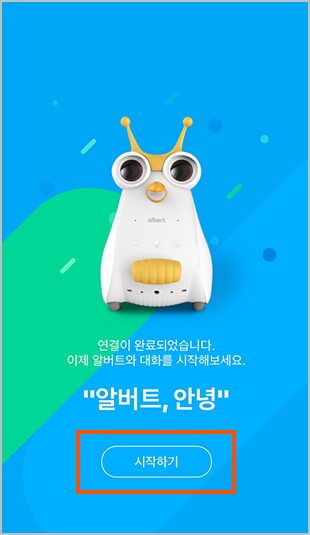

# albert AI Wifi 연결(변경)하기 

초기설정
--

- 알버트AI 연결대기 상태 만들기 1
  - 디바이스 전원을 켜고 부팅이 완료되면, 디바이스의 + - 버튼을 동시에 3초 이상 눌러주세요.
  

- 알버트AI 연결대기 상태 만들기 2
  - 알버트AI 연결대기 상태 만들기 1 방법 말고도 연결 대기 상태 만드는 방법이 있습니다.
  - 디바이스와 함께 제공된 ‘NUGU 연결하기’카드를 인식센서 밑에 밀어 넣어줍니다.
  

  
  
 NUGU 앱 설정
 --
  
  - NUGU 앱의 설정 > 디바이스 설정 메뉴에서 새 디바이스 추가하기를 선택해주세요.
  

 
 
 
  - 알버트AI 를 선택한 후 화면의 안내대로 기기 연결과 와이파이를 설정합니다.
  

  
  
  
  - Wi-Fi 가 연결되면 알버트AI 의 튜토리얼이 나오며, 시작하기 버튼을 눌러 서비스를 이용하실 수 있습니다.
  

  
  
  
  
 Wi-fi 변경하기
 --
 - 알버트AI 연결 대기 상태 진입
  - 초기 연결 설정 때와 동일한 방법으로 연결 대기 상태를 만듭니다.
  
  
  
- NUGU 앱 설정
  - NUGU 앱의 三 버튼을 누른 후 하단의 ‘설정’ 메뉴에 들어갑니다. ‘디바이스 설정’ 메뉴에서 현재 연결되어 있는 기기를 선택하여 ‘Wi-Fi’ 메뉴를 선택합니다.
  
  
  
- 화면의 안내대로 디바이스를 연결하고 변경하려는 와이파이를 선택합니다.

- Wi-Fi 가 연결되면 결과 화면이 나오며, 시작하기 버튼을 눌러 서비스를 이용하실 수 있습니다.

주의사항
--
- Wi-Fi 강도가 약할 경우 알버트 AI와의 연결이 끊길 수 있으니,공유기와 디바이스의 거리를 5M 이내로 유지시켜 주세요.
- 공유기가 2.4GHz와 5GHz를 지원하는 제품일 경우, Wi-Fi 연결 시 5GHz를 선택해 주세요. 더욱 안정적인 연결 상태를 유지할 수 있습니다.(일반적으로 Wi-Fi 이름에 5G가 표시되어 있습니다)
- Wi-Fi 연결 상황에 따라 NUGU 제품의 음성 인식 및 응답에 지연 현상이 발생할 수 있습니다. 또한, 하나의 공유기에 여러 개의 제품이 연결되어 있는 경우 Wi-Fi 연결이 끊길 수 있으니 이용에 참고하여 주세요.알버트 AI기기는 대한민국 외 다른 국가에서는 서비스가 지연되거나 불가할 수 있습니다.

